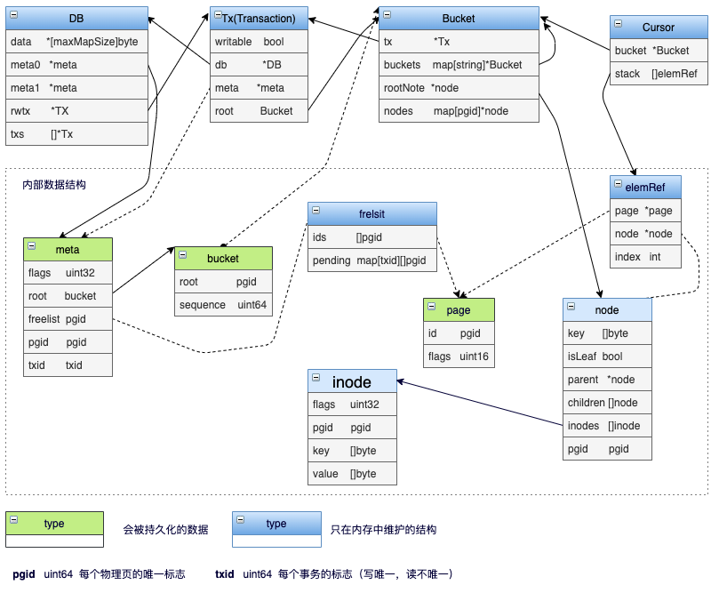

# BoltDB 简介

存储引擎一般的分为两大类，日志结构（log-structured） 的存储引擎（例如LSM树），和面向页面（page-oriented） 的存储引擎（例如B树）

BoltDB 是面向页面的存储引擎，使用 go 实现的 key/value 型数据库

目标是为不需要完整数据库服务器（如 Postgres 或MySQL）的项目提供一个简单，快速和可靠的数据库

支持事务(ACID)，使用 MVCC 和 COW，允许多个读事务和一个写事务并发执行，但是读事务会阻塞写事务

使用它的有开源的 etcd, consul，在公司视频架构内部用于uploader（重构之后的voc模块）保存分片上传的元信息，以及我们 lark_ark 服务中使用的搜索引擎 bleve 默认使用的也是 boltdb

使用它未必是因为性能有多高而是简单可靠，在工程中可控 

# 数据结构
了解任何一个工程，都要了解它的数据结构，要知道是什么对象在工程里流转，盘活整个上下文逻辑

## boltDB 数据库文件的基本格式


数据库文件以页为基本单位，一个数据库文件由若干页组成。一个页的大小是由当前OS决定的，即通过 os.GetpageSize() 来决定，对于32位系统，它的值一般为4K字节。一个Boltdb数据库文件的前两页是meta页，第三页是记录freelist的页面，第四页及后续各页则是用于存储K/V的页面，由他们来构建 B+树。

## BoltDB 中的 B+树结构


boltdb 中有 3 个结构和 B+ 树密切相关：

- page: 大小一般为 4096 bytes，对应文件里的每个 page，读写文件都是以 page 为单位。
- node: B+ 树的单个结点，访问结点时首先将 page 的内容转换为内存中的 node，每个 node 对应一个或多个连续的 page。
- bucket: 每个 bucket 都是一个完整的 B+ 树，所有操作都是针对 bucket

## page 的类型定义
```
const (
	branchPageFlag   = 0x01 // 分支节点
	leafPageFlag     = 0x02 // 叶子节点
	metaPageFlag     = 0x04 // meta 页
	freelistPageFlag = 0x10 // freelist 页，存放无数据的空 page id
)

......

type pgid uint64

type page struct {
	id       pgid   // 页 id
	flags    uint16 // 此页中保存的具体数据类型，即上面四个 Flag
	count    uint16 // 数据计数
	overflow uint32 // 是否有后序页，如果有，overflow 表示后续页的数量
}
```
- id: 页面id，如0, 1, 2，...，是从数据库文件内存映射中读取一页的索引值
- flags: 页面类型，可以分为branchPageFlag、leafPageFlag、metaPageFlag 和 freelistPageFlag，表示分支节点，叶子节点，meta 节点和 freelist 节点
- count: 页面内存储的元素个数，只在分支节点和叶子节点中有用，对应的元素分别为 branchPageElement 和 leafPageElement
- overflow: 当前页是否有后续页，如果有，overflow表示后续页的数量，如果没有，则它的值为0，主要用于记录连续多页

## page 的内存布局


> 旧版本的实现中会有一个额外的ptr字段指向数据存储地址，但在 Go 1.14 中无法通过指针安全性检查，因此这个字段已经去除了。
>
> 详细了解可以参考[PR#201 Fix unsafe pointer conversions caught by Go 1.14 checkptr](https://github.com/etcd-io/bbolt/pull/201)

## elements 的类型定义

pageHeader之后就是具体的数据存储结构。每一个键值对用一个 Element 结构体表示，并利用偏移量pos进行指针运算获取键值对的存储地址：&Element + pos == &key

```
// branchPageElement represents a node on a branch page.
type branchPageElement struct {
	pos   uint32 // Element 对应 key 存储位置相对于当前 Element 的偏移量
	ksize uint32 // Element 对应 key 的大小，以 byte 为单位
	pgid  pgid   // Element 指向的子节点所在 page id
}

······

// leafPageElement represents a node on a leaf page.
type leafPageElement struct {
	flags uint32 // 当前 Element 是否代表一个 Bucket，如果是则其值为 1，如果不是则其值为 0;
	pos   uint32 // Element 对应的键值对存储位置相对于当前 Element 的偏移量
	ksize uint32 // Element 对应 key 的大小，以 byte 为单位
	vsize uint32 // Element 对应 value 的大小，以 byte 为单位
}
```
- branchPageElement：只存储 key 的大小字段 ksize 和下一级页面的 pgid，用于数据索引。
- leafPageElement：用于存储真实的键值对数据，因此增加了 vsize 字段，以快速获取查询的键值对信息。

## elements 的内存布局


将 Element 和键值对分开存储减少了查找的时间，因为Element结构体的大小是固定的，我们可以在 O(1) 时间复杂度内获取所有的Element ，若是以 [header，key value...] 格式存储，需要按顺序遍历查找。

## node 的类型定义

Page 加载到内存中要反序列化为 node，以便进行数据修改操作。一个 node 表示为一个 B+Tree 节点，因此需要额外的 unbalanced 与 spilled 字段表明节点是否需要旋转与分裂。node中还会存储父节点与子节点的指针，用于对 key 进行范围查询

```
// node represents an in-memory, deserialized page.
type node struct {
	bucket     *Bucket // 每一个 Bucket 都是一个完整的 B+ Tree
	isLeaf     bool    // 区分 branch 和 leaf
	unbalanced bool    // 是否平衡
	spilled    bool    // 是否溢出
	key        []byte  // 该 node 的起始 key
	pgid       pgid
	parent     *node  // 父节点指针
	children   nodes  // 子节点指针
	inodes     inodes // 存储键值对的结构体数组
}

type inode struct {
	flags uint32 // 用于 leaf node，是否代表一个 subbucket
	pgid  pgid   // 用于 branch node, 子节点的 page id
	key   []byte
	value []byte
}

type inodes []inode // page中的键值对会存在node.inodes中，并且一一对应，可以通过切片下标访问某个键值对
```

boltDB 通过 node.read(p *page)，实现 page 的反序列化过程，将 page 实例化为 node
```
// read initializes the node from a page.
func (n *node) read(p *page) {
    
    ······  

	// 向 inodes 中填充键值对
	n.inodes = make(inodes, int(p.count))
	for i := 0; i < int(p.count); i++ {
		inode := &n.inodes[i]

		// 如果是leafPage，inode.flags即为元素的flags，key 和 value 分别为元素对应的 Key 和 Value
		if n.isLeaf {
			elem := p.leafPageElement(uint16(i))
			inode.flags = elem.flags
			inode.key = elem.key()
			inode.value = elem.value()

	    // 如果是branchPage，inode.pgid即为子节点的页号，inode 与 page 中的Element一一对应	
		} else {
			elem := p.branchPageElement(uint16(i))
			inode.pgid = elem.pgid
			inode.key = elem.key()
		}
		_assert(len(inode.key) > 0, "read: zero-length inode key")
	}

    ······
}
```

## bucket

每一个 bucket 都是一个完整的 B+Tree，将多个节点页面组织起来。对于 boltDB 来说，bucket 属于对外的结构，我们在 CRUD 中详细说明


# CRUD

## 读


一个典型的查找过程如下：

1. 首先找到 Bucket 的根节点，也就是 B+ 树的根节点的 page id
2. 读取对应的 page，转化为内存中的 node
3. 若是 branch node，则根据 key 查找合适的子节点的 page id
4. 重复2、3直到找到 leaf node，返回 node 中对应的 val

为了便于数据查询过程，引入 Cursor， 包含该迭代器正在遍历的 Bucket 和存储搜索路径的栈
```
type Cursor struct {
    bucket *Bucket  // 遍历的 bucket
    stack []elemRef // 记录游标的搜索路径，最后一个元素指向游标当前位置
}

type elemRef struct {
    page *page      // 当前节点的 page
    node *node      // 当前节点的 node
    index int       // page 或 node 中的下标
}
```

stack是一个切片，每个elemRef指向 B+ Tree 的一个节点，节点可能是已经实例化的node，也可能是未实例化的page，elemRef会存储对应结构的指针，另一个指针则为空，并记录键值对所在的位置。

进行查询时，Cursor 首先从 Bucket.root 对应的 page 开始递归查找，直到最终的叶子节点。Cursor.stack 中保存了查找对应 key 的路径，栈顶保存了 key 所在的结点和位置。除了常规的键值查询操作，Cursor 也支持查询 Bucket 的First、Last、Next、Prev方法，用于相关场景的优化


## 写

流程图


### 怎么回收脏页

事务提交时，将其对应的脏页添列表加进freelist的等待队列集合中。而数据结构DB中保存了所有正在进行中的事务ID。所有的写事务会递增ID，而读事务使用当前版本的ID（两个meta页中事务ID最大的一个）。因此，在创建新的写事物时，通过遍历DB中的所有事务，找出ID最小的minID, freelist的等待释放集合中任何小于minID的脏页列表都可以被安全释放


# 事务

boltdb 支持完整的事务特性(ACID)，使用 MVCC 并发控制，允许多个读事务和一个写事务并发执行，但是读事务有可能会阻塞写事务。

- Atomicity: 未提交的写事务操作都在内存中进行；提交的写事务会按照 B+ 树数据、freelist、metadata 的顺序写入文件，只有 metadata 写入成功，整个事务才算完成，只写入前两个数据对数据库无影响。
- Isolation: 每个读事务开始时会获取一个版本号，读事务涉及到的 page 不会被写事务覆盖；提交的写事务会更新数据库的版本号
- Durability: 写事务提交时，会为该事务修改的数据(dirty page)分配新的 page，写入文件。


>每个事务都有一个 txid，其中db.meta.txid 保存了最大的已提交的写事务 id。BoltDB 对写事务和读事务执行不同的 id 分配策略：
>- 读事务：txid == db.meta.txid；
>- 写事务：txid == db.meta.txid + 1；
>- 当写事务成功提交时，会更新了db.meta.txid为当前写事务 id.。

## MVCC

```
type meta struct {
    ······
	root     bucket // 存储 rootBucket 所在的 page
	freelist pgid   // freelist 所在的 pgid，初始化为 2
	pgid     pgid   // 已经申请的 page 数量，值为 max_pgid +1
	txid     txid   // 上次写事务的 id
	checksum uint64 // 上面各字段的 64 位 FNV 哈希校验
}
```
BoltDB 通过 meta 副本机制实现多版本并发控制，meta 页是事务读取数据的入口，记录了数据的版本信息与查询起点。

数据库初始化时会将页号为 0 和 1 的两个页面设置为meta页，每个事务会获得一个txid，并选取txid % 2的 meta 页做为该事务的读取对象，每次写数据后会交替更新meta页。当其中一个出现数据校验不一致时会使用另一个meta页。
```
// write writes the meta onto a page.
func (m *meta) write(p *page) {
    ......

    // 选取txid % 2的 meta 页做为该事务的读取对象
    p.id = pgid(m.txid % 2)
    p.flags |= metaPageFlag

    // 计算 checksum.
    m.checksum = m.sum64()

    m.copy(p.meta())
}
```


BoltDB 的写操作都是在内存中进行，若事务未 commit 时出错，不会对数据库造成影响；
若是在 commit 的过程中出错，BoltDB 写入文件的顺序也保证了不会造成影响：因为数据会写在新的 page 中不会覆盖原来的数据，且此时 meta中的信息不发生变化。

1. 开始一份写事务时，会拷贝一份 meta数据；
2. 从 rootBucket 开始，遍历 B+树 查找数据位置并修改；
3. 修改操作完成后会进行事务 commit，此时会将数据写入新的 page；
4. 最后更新 meta 的信息


## freelist

当经过反复的增删改查后，文件中会出现没有数据的部分。被清空数据的页可能位于任何位置，BoltDB 并不打算搬移数据、截断文件来将这部分空间返还，而是将这部分空 page，加入内部的 freelist 来维护，当有新的数据写入时，复用这些空间。

> 因此BoltDB 的持久化文件只会增大，而不会因为数据的删除而减少。

todo 字段，更新
```
type freelist struct {
    freelistType   FreelistType        // freelist type
    ids            []pgid              // 完全释放的脏页
    allocs         map[pgid]txid       // mapping of txid that allocated a pgid.
    pending        map[txid]*txPending // 等待释放的事务和脏页列表
    cache          map[pgid]bool       // fast lookup of all free and pending 
}

type txPending struct {
    ids              []pgid
    alloctx          []txid // txids allocating the ids
    lastReleaseBegin txid   // beginning txid of last matching releaseRange
}
```

freelist有FreelistArrayType与FreelistMapType两种类型，默认为FreelistArrayType格式，下面内容也是根据数组类型进行分析。当缓存记录为数组格式时，freelist.ids字段记录了当前空 page 的 pgid，当程序需要 page 时，会调用对应的freelist.arrayAllocate(txid txid, n int) pgid方法遍历ids，从中挑选出n 个连续的空page供调用者使用。

当某个写事务产生无用 page时，将调用freelist.free(txid txid, p *page)将指定 page 放入freelist.pending池中，并将freelist.cache中将该 page 设为 true，需要注意的是此时数据被没有被清空。当下一个写事务开启时，会调用freelist.release(txid txid)方法将没有任何事务使用的pending池中的 page 搬移到ids中。

BoltDB 这种设计思路，是为了实现多版本并发控制，加速事务的回滚，同时避免对读事务的干扰：

当写事务更新数据时，并不会直接覆盖旧数据所在的页，而且分配一个新的 page 将更新后的数据写入，然后将旧数据占用的 page 放入freelist.pending池中，并建立新的索引。当事务需要回滚时，只需要将pending池中的 page 删除，将索引回滚为原来的页面。
当发起一个读事务时，会单独复制一份meta信息，从这份独有的meta作为入口，可以读出该meta指向的数据。此时即使有写事务修改了相关 key 的数据，修改后的数据只会被写入新的 page，读事务引用的旧 page 会进入pending 池，与该读事务相关的数据并不会被修改。当该 page 相关的读事务都结束时，才会被复用修改

# 高性能

## MMAP
妈妈牌技术，内存映射文件（Memory-Mapped File，mmap）


mmap 是一种内存映射文件的方法，即将一个文件映射到进程的地址空间，实现文件磁盘地址和进程虚拟地址空间中一段虚拟地址的一一对映关系。

实现这样的映射关系后，进程就可以采用指针的方式读写操作这一段内存，而系统会自动回写脏页面到对应的文件磁盘上，即完成了对文件的操作而不必再调用 read(),write() 等系统调用函数

>传统的 UNIX 或 Linux 系统在内核中设有多个缓冲区，当我们调用 read()系统调用从文件中读取数据时，内核通常先将该数据复制到一个缓冲区中，再将数据复制到进程的内存空间。
>会发生两次内存拷贝

BoltDB 利用 mmap 将文件映射到内存中，直接访问这段内存获取数据，节省了从内核空间拷贝数据到用户进程空间的开销，提升了读取效率。
```
// mmap memory maps a DB's data file.
func mmap(db *DB, sz int) error {

	// 调用 mmap() 将整个文件映射进来，跨过了页缓存，减少了数据的拷贝次数，
	b, err := syscall.Mmap(int(db.file.Fd()), 0, sz, syscall.PROT_READ, syscall.MAP_SHARED|db.MmapFlags)
	if err != nil {
		return err
	}

	// 调用 madvise(MADV_RANDOM) 由操作系统管理 page cache
    // _, _, e1 := syscall.Syscall(syscall.SYS_MADVISE, uintptr(unsafe.Pointer(&b[0])), uintptr(len(b)), uintptr(advice))
	if err := madvise(b, syscall.MADV_RANDOM); err != nil {
		return fmt.Errorf("madvise: %s", err)
	}

	// 后续对磁盘上文件的所有读操作直接读取 db.data 即可，简化了实现
	db.dataref = b
	db.data = (*[maxMapSize]byte)(unsafe.Pointer(&b[0]))
	db.datasz = sz
	return nil
}
```

## COW

BoltDB 在写入文件时使用了写时复制技术（COW，Copy On Write），当一个页面被更新时，它的内容会被复制到一个新页面，旧页面会被释放。


# 高可用

# 总结


现代操作系统中常用分页技术进行内存管理，将虚拟内存空间划分成大小相同的 Page，其大小通常是 4KB


写入
BoltDB 中对文件的写入并没有使用mmap技术，而是直接通过Write()与fdatasync()这两个系统调用将数据写入文件。
在创建一个boltdb文件时，通过fwrite和fdatasync系统调用向磁盘写入32K或者16K的初始文件；在打开一个botldb文件时，用mmap系统调用创建只读内存映射，用来读取文件中各页数据。


Basics

There are only a few types in Bolt: DB, Bucket, Tx, and Cursor. The DB is
a collection of buckets and is represented by a single file on disk. A bucket is
a collection of unique keys that are associated with values.

Transactions provide either read-only or read-write access to the database.
Read-only transactions can retrieve key/value pairs and can use Cursors to
iterate over the dataset sequentially. Read-write transactions can create and
delete buckets and can insert and remove keys. Only one read-write transaction
is allowed at a time.


Caveats

The database uses a read-only, memory-mapped data file to ensure that
applications cannot corrupt the database, however, this means that keys and
values returned from Bolt cannot be changed. Writing to a read-only byte slice
will cause Go to panic.

Keys and values retrieved from the database are only valid for the life of
the transaction. When used outside the transaction, these byte slices can
point to different data or can point to invalid memory which will cause a panic.


// b+tree 原理
查找，遍历，插入，分裂，平衡

// boltdb 的实现
boltDb 代码量不多，核心代码不到4000行，但质量很高，建议大家有时间也阅读一下，对代码能力的提升很有帮助
这里我先和大家一起，把主线走一遍，方便之后阅读的时候，更容易一些


page bucket cursor tx db

db: boltdb 的顶级对象

node 是boltDb的头等公民，
page 主要提供的是xx
先不细看，我们带着问题再回来找他们


// API们
打开 111

Bolt 会在数据文件上获得一个文件锁，所以多个进程不能同时打开同一个数据库。 打开一个已经打开的 Bolt 数据库将导致它挂起，直到另一个进程关闭它
todo 文件锁在哪里


了解一个存储引擎的时候，需要了解在这几个方面是如何实现的

// 数据结构
// CRUD
Put
    b := tx.Bucket([]byte("MyBucket"))
    err := b.Put([]byte("answer"), []byte("42"))

写入数据的时候，会生成临时文件吗？ 在工程中是非常可控的. etcd和consul都用了它, 未必是因为性能有多高而是简单可靠
we have known there's no temporary file that means BoltDB use memory or called Mmap to host temporary data. use Mmap means, your BoltDB File should not bigger than your assignable memory space

mmap
mmap也是以页为单位进行映射的，如果文件大小不是页大小的整数倍，映射的最后一页肯定超过了文件结尾处，这个时候超过部分的内存会初始化为0，对其的写操作不会写入文件。但如果映射的内存范围超过了文件大小，且超出范围大于4k，那对于超过文件所在最后一页地址空间的访问将引发异常。比如我们这里文件实际大小是16K，但我们要映射32K到进程地址空间中，那对超过16K部分的内存访问将会引发异常。实际上，我们前面分析过，Boltdb通过mmap进行了只读映射，故不会存在通过内存映射写文件的问题，同时，对db.data(即映射的内存区域)的访问是通过pgid来访问的，当前database文件里实际包含多少个page是记录在meta中的，每次通过db.data来读取一页时，boltdb均会作超限判断的，所以不会存在对超过当前文件实际页数以外的区域访问的情况

因为boltdb写文件不是通过mmap，而是直接通过fwrite写文件。强调一下，boltdb对数据库的读操作是通过读mmap内存映射区完成的；而写操作是通过文件fseek及fwrite系统调用完成的


Get
    b := tx.Bucket([]byte("MyBucket"))
    v := b.Get([]byte("answer"))

迭代
    c := tx.Bucket([]byte("MyBucket"))
    for k, v := c.First(); k != nil; k, v = c.Next() {
        fmt.Printf("key=%s, value=%s\n", k, v)
    }

前缀扫描
    c := tx.Bucket([]byte("MyBucket")).Cursor()

    prefix := []byte("1234")
    for k, v := c.Seek(prefix); k != nil && bytes.HasPrefix(k, prefix); k, v = c.Next() {
        fmt.Printf("key=%s, value=%s\n", k, v)
    }

范围扫描
	c := tx.Bucket([]byte("Events")).Cursor()
    min := []byte("1990-01-01T00:00:00Z")
    max := []byte("2000-01-01T00:00:00Z")
    for k, v := c.Seek(min); k != nil && bytes.Compare(k, max) <= 0; k, v = c.Next() {
        fmt.Printf("%s: %s\n", k, v)
    }

// 持久化

// 事务
Bolt 一次只允许一个写事务，但是一次允许多个只读事务

启动写事务
err := db.Update(func(tx *bolt.Tx) error {
    ...
    return nil
})

启动读事务
err := db.View(func(tx *bolt.Tx) error {
    ...
    return nil
})


// 高可用
 备份
Blot 是一个单一的文件，所以很容易备份
使用Tx.WriteTo()函数将数据库的一致视图写入目的地。 如果您从只读事务中调用它，它将执行热备份而不会阻止其他数据库的读写操作
Tx.CopyFile()


// 高性能
// 统计
当我们运行一个xx时，需要观测的指标  split, rebalanced

// 使用场景
就像每个算法模型都有假设空间一样，数据引擎也有一定的使用场景限制


所以 boltdb 可以更容易的，与其他组件结合提供更强大的功能
比如，lark_ark 服务中使用的 bleve 搜索引擎，就提供 boltdb 作为 kvstore 层的支持

boltdb 大概就是这样，我们也可以对其二次开发，进行改造，支持我们提到的特性

在评估和使用 Bolt 时，需要注意以下几点
Bolt 适合读取密集型工作负载。顺序写入性能也很快，但随机写入可能会很慢。您可以使用DB.Batch()或添加预写日志来帮助缓解此问题。
尽量避免长时间运行读取事务。 Bolt使用copy-on-write技术，旧的事务正在使用，旧的页面不能被回收。
Bolt在数据库文件上使用独占写入锁，因此不能被多个进程共享
将大量批量随机写入加载到新存储区可能会很慢，因为页面在事务提交之前不会分裂。不建议在单个事务中将超过 100,000 个键/值对随机插入单个新 bucket中。
Bolt使用内存映射文件，以便底层操作系统处理数据的缓存。 通常情况下，操作系统将缓存尽可能多的文件，并在需要时释放内存到其他进程。 这意味着Bolt在处理大型数据库时可以显示非常高的内存使用率。 但是，这是预期的，操作系统将根据需要释放内存。 Bolt可以处理比可用物理RAM大得多的数据库，只要它的内存映射适合进程虚拟地址空间

Bolt数据库中的数据结构是存储器映射的，所以数据文件将是endian特定的。 这意味着你不能将Bolt文件从一个小端机器复制到一个大端机器并使其工作。 对于大多数用户来说，这不是一个问题，因为大多数现代的CPU都是小端的
// todo 存储器映射？
由于页面在磁盘上的布局方式，Bolt无法截断数据文件并将空闲页面返回到磁盘。 相反，Bolt 在其数据文件中保留一个未使用页面的空闲列表。 这些免费页面可以被以后的交易重复使用。 由于数据库通常会增长，所以对于许多用例来说，这是很好的方法 但是，需要注意的是，删除大块数据不会让您回收磁盘上的空间


对比
如果您需要高随机写入吞吐量（> 10,000 w / sec）或者您需要使用旋转磁盘，则 LevelDB可能是一个不错的选择。 如果你的应用程序是重读的，或者做了很多范围扫描，Bolt 可能是一个不错的选择
内存 > 数据库 && 读稳定 > 写稳定 && 读性能 > 写性能
因此在之后的搜人场景，可以使用

缺点
没有WAL/redo log, 变动直接打入B+Tree

一方面看这确实是优点, 另一方面也导致了很多更好的优化做不了. 因为没有log保护中间状态, B+Tree自身必须具有原子性. BoltDB通过COW(copy on write)来达成, 带来了可观的开销. 即使只对某个page改了1 byte也必须重写整页, 连带parent到root都需要重写, 直至meta page, 有写放大的问题. meta page更新成功是操作成功的依据.

COW使得BoltDB几乎没有成本地支持一写多读的事务, 但也做不了并发写事务了, 因为双meta page只能确保至少一份是有效的. BoltDB提供了batch write可以自我安慰一下


# 总结
原理
K/V 型存储，使用 B+ 树索引。
支持事务(ACID)，使用 MVCC 和 COW，允许多个读事务和一个写事务并发执行，但是读事务有可能会阻塞写事务，适合读多写少的场景

BoltDB 的写事务实现比较巧妙，利用 meta 副本和 freelist 机制实现并发控制，提供了一种解决问题的思路。操作系统通过 COW (Copy-On-Write) 技术进行 Page 管理，通过写时复制技术，系统可实现无锁的读写并发，但是无法实现无锁的写写并发，这就注定了这类数据库读性能很高，但是随机写的性能较差，因此非常适合于『读多写少』的场景

未必是因为性能有多高而是简单可靠，在工程中可控 


实现
交流了看源码的一些技巧
希望可以互相交流讨论


## BoltDB 数据结构全景




## 适用场景

- 程序需要内嵌数据库
- 只需要简单的键值存储，不需要复杂的SQL查询与处理
- 数据读多于写
- 需要事务保证

最后，系统设计没有银弹，适合的就是最好的
